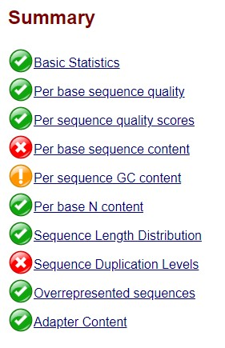
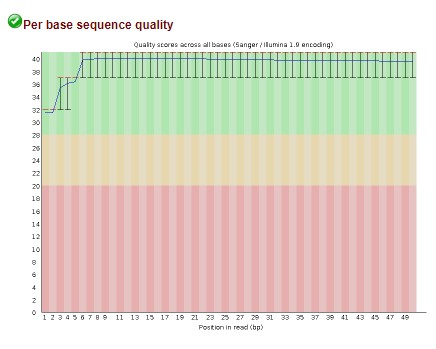
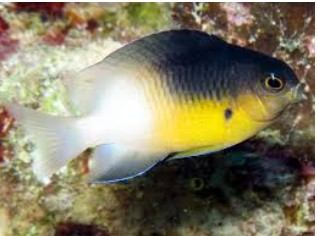

# TP NGS ClownFish

------------------------------------------------

## Titre
### Sous titre
*Italic*  
_Italic_  
**bold**  
**_italic bold_**

## Objective

Actinopterygien fishes present a high diversity of pigmentation with more than 8 various cells from the scales. To undesrtand the causes of this diveristy, the clownfish, whci harbor white bars over a darker orange body is an interesting model. By electron microscopy, cells from these white bars appeared to be similar to iridophores which make a reflective scales as it can be found in Zebrafishes. Other cells called leucophores could be responsible of the white pigmentation.  
We wonder then if the white bars are composed of iridophores, leucophores or both. To this purpose, transcriptomic analyses of white and orange scales where performed on 3 organisms and data were collected to compare transcriptomes. 

## Dataset, paper of interest

The reads are available on NCBI SRA dataset, under BioProject PRJNA482393 and BioProject PRJNA482578. Reads are found in 6 files, from SRR7591064 to SRR7591069. 

## Workflow

There are several steps to complete this study. The reads are download from the NCBI. They are 50 nucleotides length. First we determine there quality to know the validity of the study performed. Then the qua

# Download the data

**_Download.sh_**  
Download the reads for the study. 

For each file, a *fastq-dump* has been performed to download the data as fastq files
Using awk, sequence names has been renamed (trinity need that their name ends with "/1" for R1 and "/2" for R2)

awk  '{ if (NR%2 == 1 ) {gsub("\\.","_");print $1"/1"}  else  { print $0}}' $A.fastq > $A.fastq.modif
mv $A.fastq.modif $A.fastq

----------------
Exemple of fastq file: (line 4 corresponds to the quality sequence)  

    @SRR7591064_1/1
    NGCACACAGAGCTCCAACCAAAATGATAATGCCACCTGCCATGGCAATGC
    +SRR7591064_1/1
    #AAFFJJJJJJJJAJJAFJFJFFFFAJJJFJJJJJJ-AJ<JJJJFJJJJ<
    @SRR7591064_2/1
    NTTCACAAGTTATTGTTAAATTAAGACACGCTTTATAACATCTGACCACC
    +SRR7591064_2/1
    #AAAFJJJJJJJJJJJ-FJJ-FJFJJFJ7-A<FJJJJJJJJ-<A-F-FFJ

----------------

# Determine the quality of the reads

**_FastQC.sh_**  
Create an HTML file for each file of reads with the quality of sequences

**_MultiQC.sh_**  
Create one HTML file with the summary of the quality of all the files

# Quantify the expression of the transcripts 

**_Trinity.sh_**  

Assemble the reads of sequencing

----------------

Exemple of a transcript obtained with Trinity

    TRINITY_DN18_c0_g1_i1 len=919 path=[0:0-918]
    GTGAGGCTGAGTGGAGTCTGCAGGGCGCACCGATGCCCGACAGCCTGGACTGGAAGGCCGTGTATGAAGCCAGGCCGCTGGGAAGAAACTTACTGAAGAACCCCGCACCTCACGGGTTGAGTAAAGATGTTCCTCCACCTGAACCCGAGCTGGCTCAAGTGCTCACACGTGGACCTCCACGTTTTCAGCCTGATGGTGACTTCACCGGCTGGACCACGAGCATAGAAGTCCTGCCCTATGATGACAGTGGCATCCCAGAAGGTGCTGTGGTCTGTGCTTTGCCTACATATAGCTGGTTCACTATGGAGCAGGTTGTGGACCTGAAGGCAGAGGGACTGTGGGACGAGCTGCTGGATGCTTTTCAGCCTGAAATAGTCATCCAAGACTGGTATGAGGAGAGTCAGCTGCATAAATCCATCTACCAGCTGCATGTGAAGTTACTGGGTGCGGACAAAAGCACGGTGATCTCAGAGCACTCTGTCAGCCCCACTGAGGAGCTCAGCGTTTACTCACACAACTGGAAGGAGGTGTCGCATGTGTTCTCCGGCTATGGACCCGGGGTCAGATATGTCCACTTCGTTCACCGACTGAAGAACAGTTTCCTGAATGGGTTCTTTCCCACGCTGTTCACCGGCAGCTCAGTGATTGTGAAACCAATCAAAACCAGCCCATAGGACAAATCCTGCCATGCACGTGTAGCTGCTCATATACCCAACCAGTTTTATCAGCCAGTTTGGTCTTTAGGCTGGCAACTGAAAAGAACGTAACAGTCTTTTTATTGACTAGTTTTGATTTGTTTGTCGGAGTTGATTTTTGCAATAGCTTTTGAGATATTTTTCAAATAAGGTCAAACTTCGTTGTCTTCTGAGGGTTGCTGTGTGGTGCAATAATAAAAAATACAGTTCACATAAAAAAAAAA

----------------

**_Salmon.sh_**  

quantify the expression of the transcripts. This script uses the reads and the 

**_reference.sh_**  
Download the genes of the reference species (stegastes partitus)

**_transcod.sh_**  
prepare the genes of the studied species to be able to annotate them with a reference species 

### Commands

_cd_ go in a specific folder
_mkdir folder_ create a folder (mkdir -p folder to avoid to create again a folder which already exists) 
_cat_ open a file (ONLY little files)
_less_ open a file (better), use :q to quit

_$file/folder_ $ is use when we want to do something from a variable or a file (cd $data ...)
_var=$folder/*.fastq_ make a list with all the .fastq files of the folder

_chmod +x script.sh_ give the right to use a script 
_nohup ./script.sh >& nohup.script &_ run a script and put the informations in a file nohup.script

_htop_ have a look at the current processes (precise)
_ps_ have a look at the current processes (not precise)

_grep "Mapping rate" nohup.salmon_ find the sentences with "Mapping rate" in the file nohup.salmon

