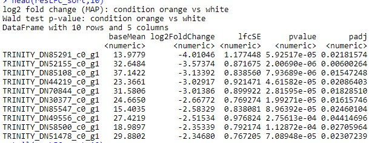
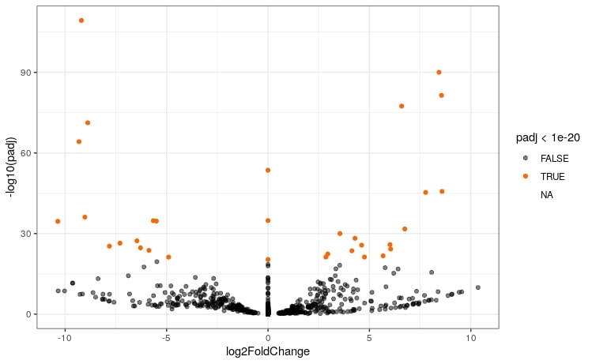

# TP NGS ClownFish

------------------------------------------------


## Titre
### Sous titre
*Italic*  
_Italic_  
**bold**  
**_italic bold_**


## Objective

Actinopterygien fishes present a high diversity of pigmentation with more than 8 various cells from the scales. To undesrtand the causes of this diversity, the clownfish, which harbor white bars over a darker orange body is an interesting model. By electron microscopy, cells from these white bars appeared to be similar to iridophores which make a reflective scales as it can be found in Zebrafishes. Other cells called leucophores could be responsible of the white pigmentation.  
We wonder then if the white bars are composed of iridophores, leucophores or both. To this purpose, transcriptomic analyses of white and orange scales where performed on 3 organisms and data were collected to compare transcriptomes. 


## Dataset, paper of interest

The reads are available on NCBI SRA dataset, under BioProject PRJNA482393 and BioProject PRJNA482578. Reads are found in 6 files, from SRR7591064 to SRR7591069.

## Workflow

There are several steps to complete this study. The reads are download from the NCBI. They are 50 nucleotides length. First we determine there quality to know the validity of the study performed. Then the qua

### 1) Download the data

* **_Download.sh_**  
Download the reads for the study. 

For each file, a *fastq-dump* has been performed to download the data as fastq files
Using awk, sequence names has been renamed (trinity need that their name ends with "/1" for R1 and "/2" for R2)

```awk  '{ if (NR%2 == 1 ) {gsub("\\.","_");print $1"/1"}  else  { print $0}}' $A.fastq > $A.fastq.modif mv $A.fastq.modif $A.fastq```

----------------
Exemple of fastq file: (line 4 corresponds to the quality sequence)  

    @SRR7591064_1/1
    NGCACACAGAGCTCCAACCAAAATGATAATGCCACCTGCCATGGCAATGC
    +SRR7591064_1/1
    #AAFFJJJJJJJJAJJAFJFJFFFFAJJJFJJJJJJ-AJ<JJJJFJJJJ<
    @SRR7591064_2/1
    NTTCACAAGTTATTGTTAAATTAAGACACGCTTTATAACATCTGACCACC
    +SRR7591064_2/1
    #AAAFJJJJJJJJJJJ-FJJ-FJFJJFJ7-A<FJJJJJJJJ-<A-F-FFJ

----------------


### 2) Determine the quality of the reads

* **_FastQC.sh_**  
Create an HTML file for each file of reads with the quality of sequences

Here is an exemple of a fastqc result obtained with our data. The quality was good enough, considering that a high duplication level is normal in RNAseq, and the Per "Base Sequence Content" is caused by a common problem of the primers synthesis.


* **_MultiQC.sh_**  
Create one HTML file with the summary of the quality of all the files. The same results than fastqc are obtained but with all the different files represented on the different graphs. It is usefull to detect an eventual issue when many files are used. 

### 3) Quantify the expression of the transcripts 


* **_Trinity.sh_**  
Assemble the reads of sequencing

----------------

Exemple of a transcript obtained with Trinity

    TRINITY_DN18_c0_g1_i1 len=919 path=[0:0-918]
    GTGAGGCTGAGTGGAGTCTGCAGGGCGCACCGATGCCCGACAGCCTGGACTGGAAGGCCGTGTATGAAGCCAGGCCGCTGGGAAGAAACTTACTGAAGAACCCCGCACCTCACGGGTTGAGTAAAGATGTTCCTCCACCTGAACCCGAGCTGGCTCAAGTGCTCACACGTGGACCTCCACGTTTTCAGCCTGATGGTGACTTCACCGGCTGGACCACGAGCATAGAAGTCCTGCCCTATGATGACAGTGGCATCCCAGAAGGTGCTGTGGTCTGTGCTTTGCCTACATATAGCTGGTTCACTATGGAGCAGGTTGTGGACCTGAAGGCAGAGGGACTGTGGGACGAGCTGCTGGATGCTTTTCAGCCTGAAATAGTCATCCAAGACTGGTATGAGGAGAGTCAGCTGCATAAATCCATCTACCAGCTGCATGTGAAGTTACTGGGTGCGGACAAAAGCACGGTGATCTCAGAGCACTCTGTCAGCCCCACTGAGGAGCTCAGCGTTTACTCACACAACTGGAAGGAGGTGTCGCATGTGTTCTCCGGCTATGGACCCGGGGTCAGATATGTCCACTTCGTTCACCGACTGAAGAACAGTTTCCTGAATGGGTTCTTTCCCACGCTGTTCACCGGCAGCTCAGTGATTGTGAAACCAATCAAAACCAGCCCATAGGACAAATCCTGCCATGCACGTGTAGCTGCTCATATACCCAACCAGTTTTATCAGCCAGTTTGGTCTTTAGGCTGGCAACTGAAAAGAACGTAACAGTCTTTTTATTGACTAGTTTTGATTTGTTTGTCGGAGTTGATTTTTGCAATAGCTTTTGAGATATTTTTCAAATAAGGTCAAACTTCGTTGTCTTCTGAGGGTTGCTGTGTGGTGCAATAATAAAAAATACAGTTCACATAAAAAAAAAA

----------------


* **_Salmon.sh_**  
quantify the expression of the transcripts. This script takes the transcripts from Trinity and makes first an index. Then it uses this index to quantify for each transcript the number of associated reads. 
One important parameter to choose in the "salmon index" is the k, to indicate the sensibility of alignement between the reads and the transcripts.


we use *grep "Mapping rate" nohup.salmon* to find the % of mapping in the nohup. We obtained 95.3385%


```
salmon index -k 25 -t $data/sra_data_Trinity/Trinity.fasta -i $data/sra_data_Trinity/trinity_index
salmon quant -l SR --validateMappings --gcBias -p 16 -i $data/sra_data_Trinity/trinity_index -o data_salmon/$Name -r $A
```

Importance of k !
Nohup informations ?

----------------

Exemple of results obtained with salmon. The first column indicates the name of a transcript assemble by Trinity, and the last column the number of reads associated with it.

             Name          Length   EffectiveLength      TPM         NumReads
    TRINITY_DN92_c0_g1_i3   1670      1338.838        0.000000        0.000
    TRINITY_DN32_c0_g1_i4   1927      1787.007        0.000000        0.000
    TRINITY_DN32_c0_g1_i5   2277      2112.714        8.443555        2501.624
    TRINITY_DN32_c0_g1_i6   1927      1788.113        14.277959       3580.280
    TRINITY_DN32_c0_g1_i7   2277      2111.608        0.000000        0.000
    TRINITY_DN32_c0_g1_i1   1255      1080.733        4.774877        723.663
    TRINITY_DN32_c0_g1_i2   1802      1672.297        0.000000        0.000
    TRINITY_DN32_c0_g1_i3   1802      1682.080        3.596785        848.432

----------------

### 3) Annotation of the transcripts with a reference species

* **_reference.sh_**  
Download the genes of the reference species (stegastes partitus)


```wget -O data_reference/spartitus_coding.fa.gz http://ftp.ensembl.org/pub/release-102/fasta/stegastes_partitus/cds/Stegastes_partitus.Stegastes_partitus-1.0.2.cds.all.fa.gz```

Then the name was change to make it more clear with a complicated script, parse.awk

----------------

Exemple of data obtained with reference.sh

    ENSSPAT00000000002.1 cds primary_assembly:Stegastes_partitus-1.0.2:KK580071.1:9353:21963:-1 gene:ENSSPAG00000000002.1 gene_biotype:protein_coding transcript_biotype:protein_coding gene_symbol:homer3a description:homer protein homolog 3-like [Source:NCBI gene;Acc:103352799]
    ATGGGATGTCAGCCGATCTTCAGCGCCCGGGCCCACGTCTTCCAGATCGACCCCAACACC
    AAGAGGAACTGGATCCCTGCCAGTAAACATGCCGTCACCGTGTCCTTCTTCTACGATGCC
    AATCGCAACGTGTATCGCATCATCAGCGTGGGCGGGACCAAGGCGATCATCAACTGCACC


Same exemple of data renamed with with reference.sh

    ENSSPAG00000000002.1|homer3a
    ATGGGATGTCAGCCGATCTTCAGCGCCCGGGCCCACGTCTTCCAGATCGACCCCAACACC
    AAGAGGAACTGGATCCCTGCCAGTAAACATGCCGTCACCGTGTCCTTCTTCTACGATGCC
    AATCGCAACGTGTATCGCATCATCAGCGTGGGCGGGACCAAGGCGATCATCAACTGCACC

---------------


* **_transcod.sh_**  
prepare the genes of the studied species to be able to annotate them with a reference species. 2 steps minimal are needed.

The first step allows to find coding sequences (cds) by finding start and stop codons. 

```
TransDecoder.LongOrfs -t $data/sra_data_Trinity/Trinity.fasta --gene_trans_map $data/sra_data_Trinity/Trinity.fasta.gene_trans_map -m 100 -S -O data_transdecoder_files
```
The second step sorts the cds to know which one will be used or not. A step can add before this one to annotate the cds with a database. In our case, we kept the longer cds which is the most likely to be the good one.

```
TransDecoder.Predict -t $data/sra_data_Trinity/Trinity.fasta --single_best_only --cpu 14 -O data_transdecoder_files
```


* **_blast.sh_**  
identify with the reference species the genes corresponding to the transcripts obtained.
Before doing this, the trinity file was renamed with *awk '{print $1}' Trinity.fasta.transdecoder.cds > Trinity.fasta.transdecoder.rename.cds*

makeblastdb build a reference database to allows the blast to be performed on our data. Then, blastn do a blast from the data obtained with transDecoder on the reference species choosed. 

```
makeblastdb -dbtype nucl -in $data_reference/spartitus_coding_format.fa -out $db
blastn -db $db -query $data_transdecoder/Trinity.fasta.transdecoder.rename.cds -evalue 1e-20 -outfmt 6 -out $out_blast/blast_file
```
*evalue*: determine the threshold for the hits. The higher is the threshold, the more hits there are but with a higher probability to have false positives. For a species homology we usually use "1e-10"
*outfmt*: choose the outfile format we want (the 6 is the best one for Corentin !)


----------------
This in an exemple of data obtained with the blast. We have the transcrit identifier and the corresponding gene.

    TRINITY_DN0_c0_g1_i1.p1 ENSSPAG00000000515.1|hmcn1      88.341  892     100     4       68      957     56      945     0.0     1068
    TRINITY_DN10000_c0_g1_i1.p1     ENSSPAG00000017035.1|oprd1b     86.264  961     123     7       70      1024    106     1063    0.0     1035
    TRINITY_DN10000_c0_g1_i1.p1     ENSSPAG00000017041.1|cyfip1     86.553  818     101     8       287     1101    332     1143    0.0     893
    TRINITY_DN10000_c0_g1_i2.p1     ENSSPAG00000017035.1|oprd1b     83.368  962     140     16      70      1015    106     1063    0.0     872
    TRINITY_DN10000_c0_g1_i2.p1     ENSSPAG00000017041.1|cyfip1     86.169  817     97      9       287     1092    332     1143    0.0     869

We use *cut -f1 blast_file |sort |uniq |wc -l* to determine the number of sequences that have been aligned
We found 25.000 which must correpond to the number of genes in the fish skin.

----------------

### 4) Statistical analysis

* **_DE.R_**  

This script uses the data from salmon and makes stastics and plots to anlyze them. The expressions level are compared between the conditions for each transcript to answer the biological question, but the low number of replicates did not allow us to use classical statistical approaches. We 

In this analysis we only keep the genes with more than 10 reads (it decreases drastically the number of tests of correlation).

We obtained a table of results with several columns:  



*BaseMean*: gene expression level. A high BaseMean correspond to a high expressed gene.  
*log2FoldChange*: compare the treatment (white) to the control. (FC=1: same expression / FC=2: 2x more in the treatment / FC=0.5: 2x more in the control). We take a log2 to have a symetrical parameter (log2FC>0: overexpression with the treatment) 
*stat*: test statistic. padj = pvalue adjusted with FDR.  

Then several plots were made. Unfortunately, something went wrong in this script and the script obtained appeared to be wrong.
    


* **DE2.R**

Because the first script didn't work, one from another personn of the group was used (Vinciane)

----------------

results with different plots

* The MAplot shows the log2FoldChange and the BaseMean which respectively correspond to the difference of expression between the sample and the control, and the expression level. The genes with a positive log2FC are overexpressed in the orange skin, and the genes with a negatie log2FC are overexpressed in the white skin.  
A relationship between the the log2FC and the baseMean was observed and corrected with ```lfcShrink```  
The genes corresponding to the bigger plots are the genes with padj<1e-20. They belong to 2 groups: down-regulated genes (log2FC<0) and up-regulated genes (log2FC>0)  


* The volcano plot is another representation of the results with the adjusted p-value (by DESeq tool) and the log2FC. The genes with a low padj are the one with a high difference of expression between the white and orange skin.



*A principal component analysis was also performed


*Manual annotation of top differentially expressed genes (by Vinciane)


----------------


pvalue : H0 (hyp absence effet cad gene pas differentielmt exprimé dans 2 conditions), alpha = seuil pour rejetter H0 (en general 5%). pvalue = proba de rejetter hyp nulle alors qu'elle est vraie. Plus pvalue est faible et plus on est confiant. On voit que gene avec pvalue faible on un log2FC different de 0

gunzip fichier ??


## Commands

_cd_ go in a specific folder
_mkdir folder_ create a folder (mkdir -p folder to avoid to create again a folder which already exists) 
_cat_ open a file (ONLY little files)
_less_ open a file (better), use :q to quit

_$file/folder_ $ is use when we want to do something from a variable or a file (cd $data ...)
_var=$folder/*.fastq_ make a list with all the .fastq files of the folder

_chmod +x script.sh_ give the right to use a script 
_nohup ./script.sh >& nohup.script &_ run a script and put the informations in a file nohup.script

_htop_ have a look at the current processes (precise)
_ps_ have a look at the current processes (not precise)

_grep "Mapping rate" nohup.salmon_ find the sentences with "Mapping rate" in the file nohup.salmon


